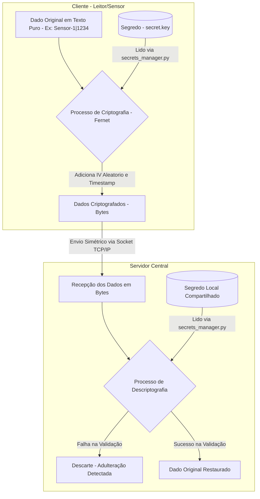

```mermaid
flowchart TD
    subgraph Cliente [Cliente - Leitor/Sensor]
        A["Dado Original em Texto Puro - Ex: Sensor-1|1234"] --> C{Processo de Criptografia - Fernet}
        B[(Segredo - secret.key)] -->|Lido via secrets_manager.py| C
        C -->|Adiciona IV Aleatorio e Timestamp| D[Dados Criptografados - Bytes]
    end

    D -->|Envio Simétrico via Socket TCP/IP| E

    subgraph Servidor [Servidor Central]
        E[Recepção dos Dados em Bytes] --> F{Processo de Descriptografia}
        G[(Segredo Local Compartilhado)] -->|Lido via secrets_manager.py| F
        F -->|Falha na Validação| H[Descarte - Adulteração Detectada]
        F -->|Sucesso na Validação| I[Dado Original Restaurado]
    end
```
